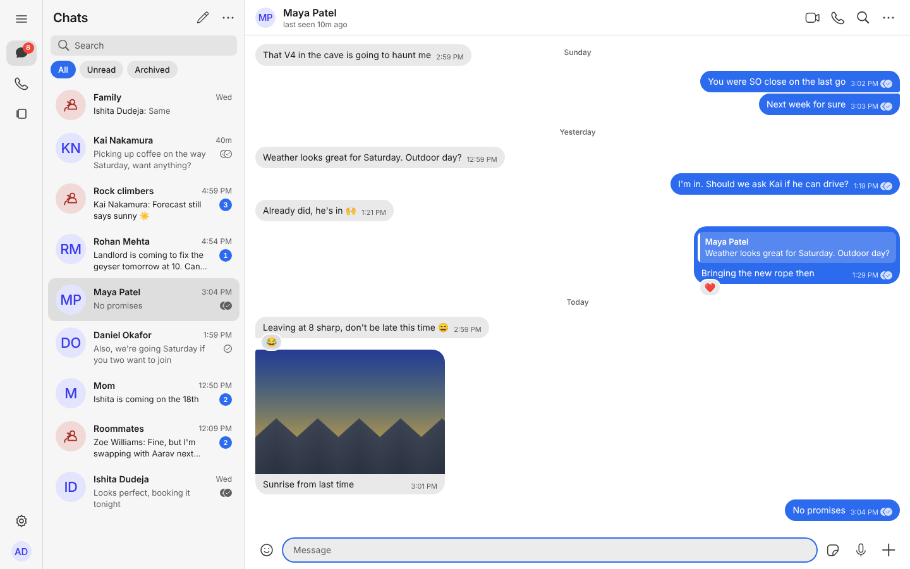
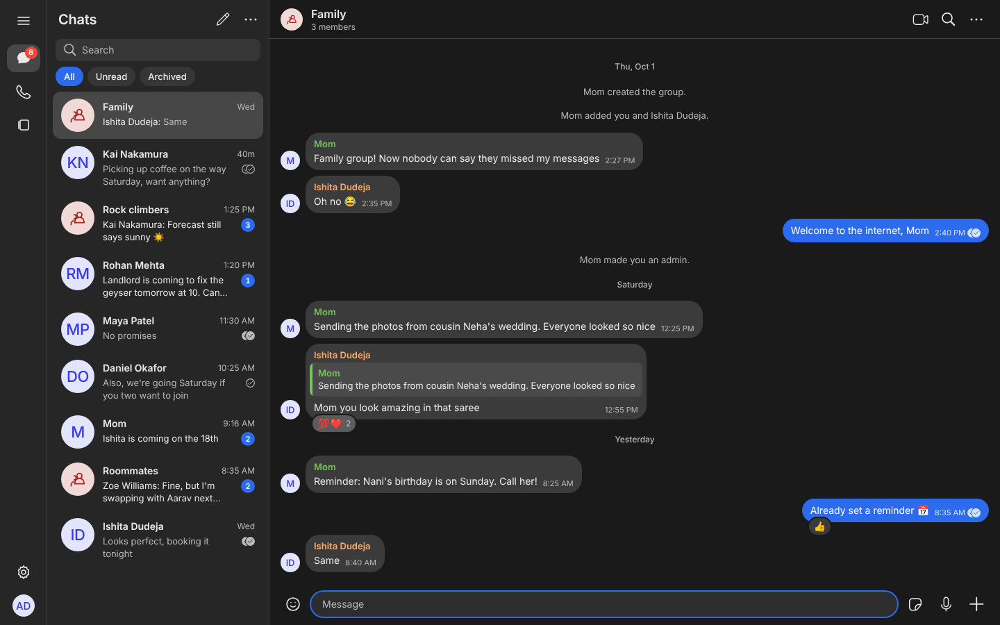
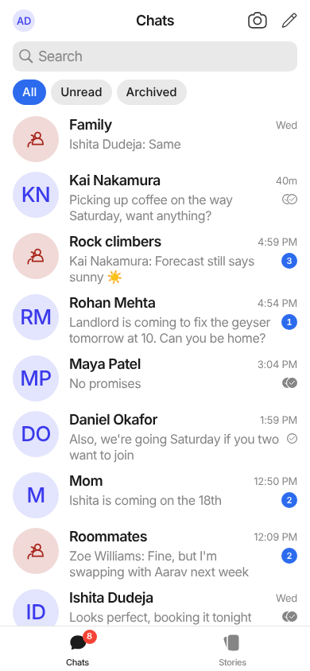
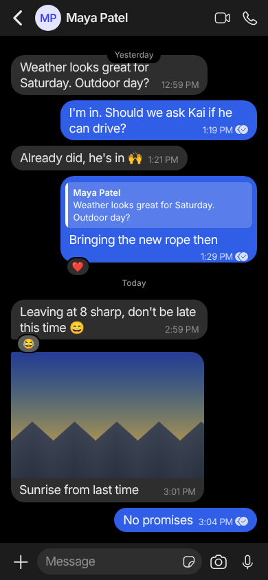
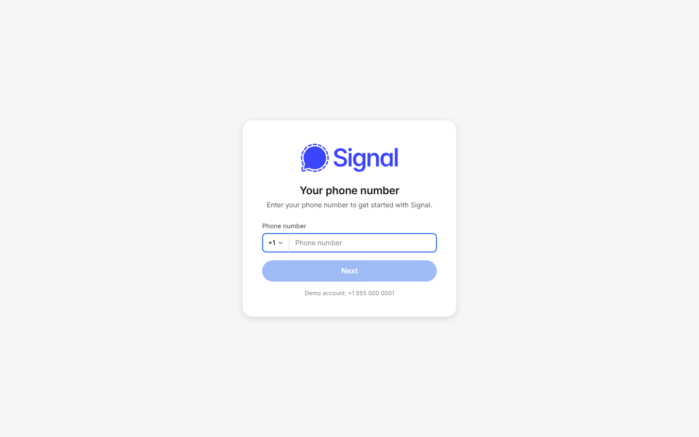

# Signal Messenger clone

A full-stack clone of Signal: Signal Desktop's layout on wide screens, and Signal iOS's layout below 600px. Next.js (App Router) + TypeScript on the front, FastAPI + SQLAlchemy + SQLite on the back, with real-time delivery over WebSockets.

Built for the Scaler SDE Fullstack assignment. Domain words (User, Contact, Conversation, Member, Receipt, ...) are defined in [`CONTEXT.md`](CONTEXT.md); the API and database are specified in [`docs/CONTRACT.md`](docs/CONTRACT.md); how and why it is built is in [`docs/GUIDE.md`](docs/GUIDE.md).

## Features

Checked against the glossary in `CONTEXT.md`. Backend rules are covered by `pytest`; the sign-in, conversation list, send and live-receive path is covered by the Playwright smoke test (`e2e/`).

- [x] Sign in by phone number with a mocked OTP (always `123456`); new users set a name, about and photo
- [x] Direct conversations (at most one per pair of users) and group conversations with admins
- [x] Group admin rules: rename, add and remove members, make admins, leave (the oldest member becomes admin if the last admin leaves)
- [x] Contacts as private, one-way address-book entries with optional nicknames
- [x] Conversation list sorted by last activity, with unread counts, pin, mute and archive
- [x] Text messages with optimistic sending (client id), replies, emoji reactions, delete for everyone
- [x] Message status: sending, sent, delivered, read (the weakest across recipients in a group)
- [x] Typing indicators and online / last seen presence
- [x] Disappearing-message timer per conversation, with system messages in the timeline
- [x] Attachments (bonus): up to 10 images, PDFs, text, zip, audio or video files (10 MB each) per message with a caption; file picker, paste and drag-and-drop; upload progress, retry, Signal-style image grid, lightbox, download, quotes with a thumbnail; files are deleted with the message
- [x] Search across conversations, contacts and messages
- [x] Settings: profile (name, about, photo upload), appearance (System / Light / Dark), chats, notifications, privacy, about, log out
- [x] Keyboard shortcuts (press `?` in the app): Ctrl/Cmd+K search, Alt+N new chat, Alt+G new group, Alt+S settings, Alt+Up/Down switch chat, Esc close chat
- [x] Light and dark themes; responsive layouts (desktop three-column, phone single-column with tab bar)
- [ ] Calls, Stories, Linked devices, Help and Donate: "Coming soon" placeholders, as intended
- [ ] Note to Self (bonus, not built)

## Tech stack

| Layer | Choice |
|---|---|
| Frontend | Next.js 16 (App Router), React 19, TypeScript, CSS Modules with design tokens, zustand for state, vitest |
| Backend | Python 3.13, FastAPI, SQLAlchemy 2, Pydantic, native WebSockets, pytest |
| Database | SQLite (one file, created and seeded by the backend) |
| Real-time | A single WebSocket per tab (`/ws?token=`) for pushes, typing and presence; REST for every change |
| Tooling | Playwright smoke test, GitHub Actions CI, Dockerfiles and compose |

## Architecture overview

```
 Browser (Next.js, zustand store)
   │  REST  /api/*   (sends, edits, settings: JSON, Bearer token)
   │  WS    /ws      (server pushes: message.new, receipt, typing, presence...)
   ▼
 FastAPI ── routers (HTTP/WS only) ── services (rules, transactions) ── SQLAlchemy ── SQLite
                                         │                                 └─ MEDIA_DIR (avatars, attachments)
                                         └─ presenter (rows → API shapes), WebSocket hub (user → sockets)
```

- **Changes go through REST, pushes go through the WebSocket.** A message is a `POST`; the server stores it, then the hub pushes `message.new` to every member's open sockets, including the sender's other tabs. This keeps every write validated, idempotent (`client_id`) and testable without a socket.
- **Optimistic UI.** The client shows a `sending` bubble at once, and reconciles it by `client_id` when the response or push arrives.
- **Receipts** are one row per recipient; a message's status is the weakest across recipients. Unread counts come from a per-member read pointer instead of per-message flags.
- **Frontend layers:** `components/ui` (presentational Signal design system), `features/*` (screens), `store` (zustand), `lib` (API client, socket, formatting). Desktop is rail | list | pane; below 600px it collapses to the phone layout.
- Full detail and the reasoning behind each choice: [`docs/GUIDE.md`](docs/GUIDE.md).

## Database schema

Nine tables, all with foreign keys and indexes defined in `backend/app/models.py` (exact columns in [`docs/CONTRACT.md`](docs/CONTRACT.md#database-schema-sqlite-via-sqlalchemy-2)).

| Table | Purpose | Key constraints |
|---|---|---|
| `users` | Accounts | `phone` unique |
| `sessions` | Login sessions (sha256 of the token, never the token) | `token_hash` unique |
| `contacts` | Private one-way address book with nickname | unique `(owner, contact)`, no self-contact |
| `conversations` | Direct or group; `last_message_at` for list order; `disappearing_seconds` | `direct_key` unique (`"minId:maxId"`) allows one direct chat per pair |
| `conversation_members` | Membership, role, per-member pin/mute/archive, `last_read_message_id`, `joined_at`/`left_at` | unique `(conversation, user)` |
| `messages` | Text or system messages, reply link, `client_id`, `expires_at`, soft delete | unique `(sender, client_id)`; index `(conversation, id)` |
| `attachments` | Uploaded files, ordered within a message | `storage_name` unique (random) |
| `message_receipts` | Per-recipient `delivered_at` / `read_at` | PK `(message, user)` |
| `message_reactions` | One emoji per user per message | PK `(message, user)` |

```
users ─< contacts >─ users
users ─< conversation_members >─ conversations ─< messages ─< message_receipts
                                                      │  └─< message_reactions
                                                      └─< attachments
```

## API overview

All REST paths are under `/api` with `Authorization: Bearer <token>`; errors are `{"detail": "..."}`. Interactive docs are at `/docs` when the backend runs. Full request/response shapes: [`docs/CONTRACT.md`](docs/CONTRACT.md).

| Area | Endpoints |
|---|---|
| Auth | `POST /auth/request-otp`, `POST /auth/verify-otp`, `POST /auth/logout`, `GET/PATCH /me`, `POST /me/avatar` |
| Contacts & search | `GET /users/lookup`, `GET/POST /contacts`, `PATCH/DELETE /contacts/{user_id}`, `GET /search?q=` |
| Conversations | `GET /conversations`, `POST /conversations/direct`, `POST /conversations/group`, `GET/PATCH /conversations/{id}`, `PATCH /conversations/{id}/settings` |
| Group admin | `POST /conversations/{id}/members`, `PATCH/DELETE /conversations/{id}/members/{user_id}` |
| Messages | `GET/POST /conversations/{id}/messages`, `POST /conversations/{id}/read`, `DELETE /messages/{id}`, `PUT/DELETE /messages/{id}/reaction` |
| Attachments | `POST /conversations/{id}/attachments`, `GET /attachments/{id}` |
| WebSocket | `/ws?token=`: client sends `typing`, `delivered`, `ping`; server pushes `message.new`, `message.updated`, `receipt`, `conversation.updated`, `conversation.removed`, `read`, `typing`, `presence` |

## Assumptions

- Identity is a phone number; the OTP is mocked and always `123456`. Encryption is simulated (interface text only), as the brief allows.
- A "contact" is a private, one-way address-book entry; anyone with an account can be messaged by phone number.
- One direct conversation per pair of users; groups have admins (creator first) and the oldest member is promoted if the last admin leaves.
- "Online" means at least one open WebSocket; "last seen" is the time the last one closed.
- The seed (`python -m app.seed`) resets the database and creates 8 users; log in as `+15550000001` (Aarav Dudeja).
- SQLite is enough for a demo-scale deployment, and it needs a persistent disk when hosted.
- Features the brief marks as placeholders (calls, stories, linked devices) show "Coming soon".

## Quickstart

Needs Python 3.13 and Node 22.

```bash
# 1. Backend: http://localhost:8000 (API docs at /docs)
cd backend
python3.13 -m venv .venv && .venv/bin/pip install -r requirements.txt
.venv/bin/python -m app.seed
.venv/bin/uvicorn app.main:app --reload --port 8000

# 2. Frontend: http://localhost:3000   (in a second terminal)
cd frontend
npm ci
npm run dev
```

Or run both with one command: `scripts/dev.sh` (seeds the database first). With Docker: `docker compose up --build`. More detail in [`docs/RUNNING.md`](docs/RUNNING.md). Hosting the demo (Render + Vercel): [`docs/DEPLOY.md`](docs/DEPLOY.md).

### Demo accounts

Sign in with any of `+15550000001` to `+15550000008`; the OTP is always `123456`. `+15550000001` is **Aarav Dudeja**, who has the most data (about six direct chats, three groups, unread messages, replies, reactions, one disappearing-message chat). Open a second browser profile signed in as `+15550000002` (Maya Patel) to see both sides live.

Any other phone number creates a new account and takes you through the profile step.

## Configuration

| Variable | Where | Default | Meaning |
|---|---|---|---|
| `NEXT_PUBLIC_API_URL` | frontend, read at build/dev start | `http://localhost:8000` | URL the browser uses to reach the backend |
| `DATABASE_URL` | backend | `sqlite:///./signal.db` | SQLAlchemy URL |
| `MEDIA_DIR` | backend | `./media` | Uploaded avatars, served at `/media/...` |
| `ALLOWED_ORIGINS` | backend | `http://localhost:3000` | Comma-separated CORS origins |
| `FIXED_OTP` | backend | `123456` | The mocked verification code |

Examples: [`.env.example`](.env.example) (docker compose), [`backend/.env.example`](backend/.env.example), [`frontend/.env.example`](frontend/.env.example).

## Tests

```bash
cd backend && .venv/bin/pytest -q                  # 50 tests: REST rules, receipts, WebSocket pushes
cd frontend && npx tsc --noEmit && npx eslint src && npx vitest run && npx next build
cd e2e && npm install && npm run smoke            # needs both servers running; see e2e/smoke.mjs
```

## Project layout

```
backend/        FastAPI app (routers -> services -> SQLAlchemy models), WebSocket hub, seed, tests
frontend/       Next.js app
  src/app/        routes: (app)/ is the signed-in shell, login/
  src/components/ui/   presentational component library (Signal design system)
  src/features/   screens: auth, sidebar, chat, dialogs, settings, shell
  src/store/      Zustand stores and the realtime wiring
  src/lib/        API client, WebSocket client, formatting, types
  src/styles/tokens.css   design tokens (light and dark)
design-system/  the design reference the UI components were ported from
docs/           CONTRACT.md (API + schema), GUIDE.md (architecture), RUNNING.md
e2e/            Playwright smoke test
scripts/        dev.sh
docker-compose.yml, backend/Dockerfile, frontend/Dockerfile
```

## Screenshots

| Desktop, direct chat (light) | Desktop, group chat (dark) |
|---|---|
|  |  |

| Phone, chat list (light) | Phone, chat (dark) | Login |
|---|---|---|
|  |  |  |

Settings: [`docs/screenshots/desktop-settings-light.png`](docs/screenshots/desktop-settings-light.png).

## Known limitations

- The OTP is mocked, and "end-to-end encryption" and safety numbers are interface text only. Messages are stored in plain text.
- SQLite with synchronous SQLAlchemy sessions inside async endpoints: fine for a demo, not for heavy load (see `backend/README.md`).
- No voice notes, camera capture, calls, stories or linked devices. Audio and video attachments are downloadable files, with no inline player.
- Attachment files are served from `/media/attachments/<random name>` without authentication: the 128-bit random name is the only protection (metadata endpoints do check membership). A real deployment would use signed, expiring URLs. Uploads are limited to 10 MB each and an allowlist of types (no SVG or HTML on purpose).
- Settings for chats and notifications are stored in the browser (`localStorage`), per device. The notification switches do not send push notifications yet.
- Disappearing-message timers are set per conversation; there is no account-wide default.
- Running the seed resets the database and signs everyone out.
- The Docker files were written but not built in the authoring environment (no Docker daemon was available).
